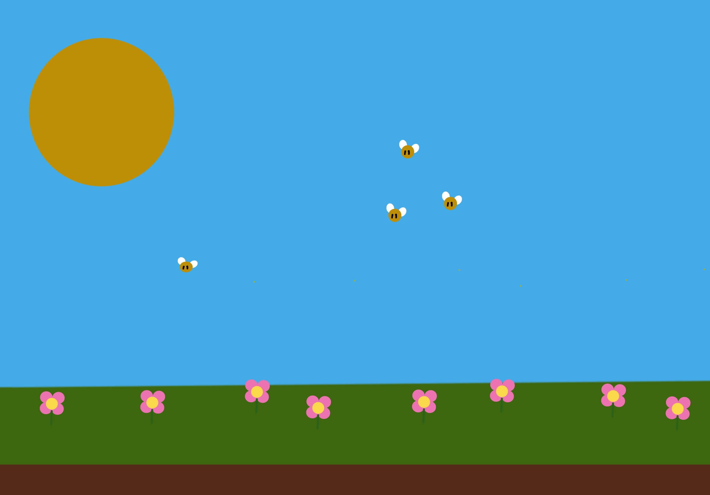
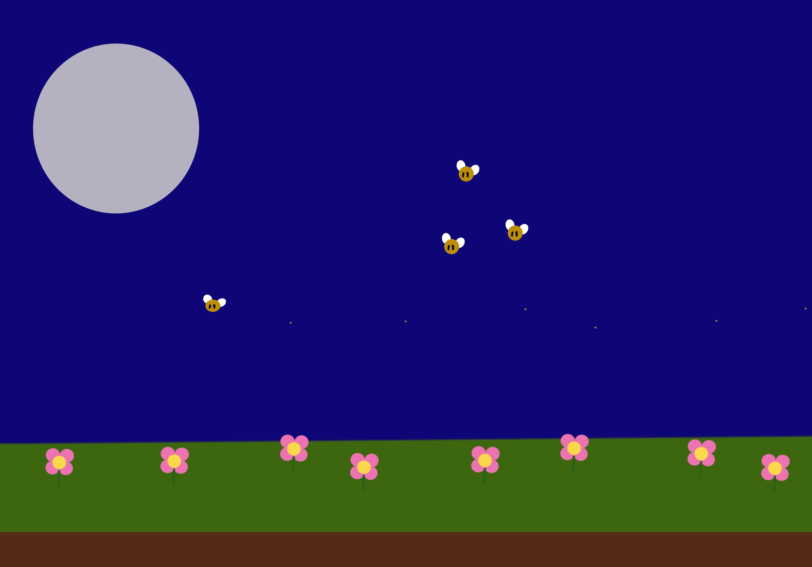
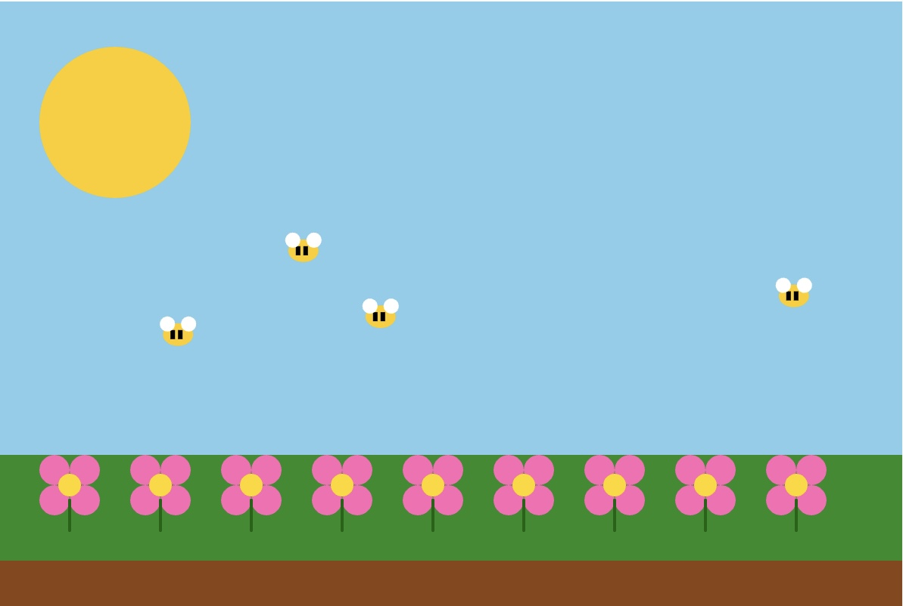
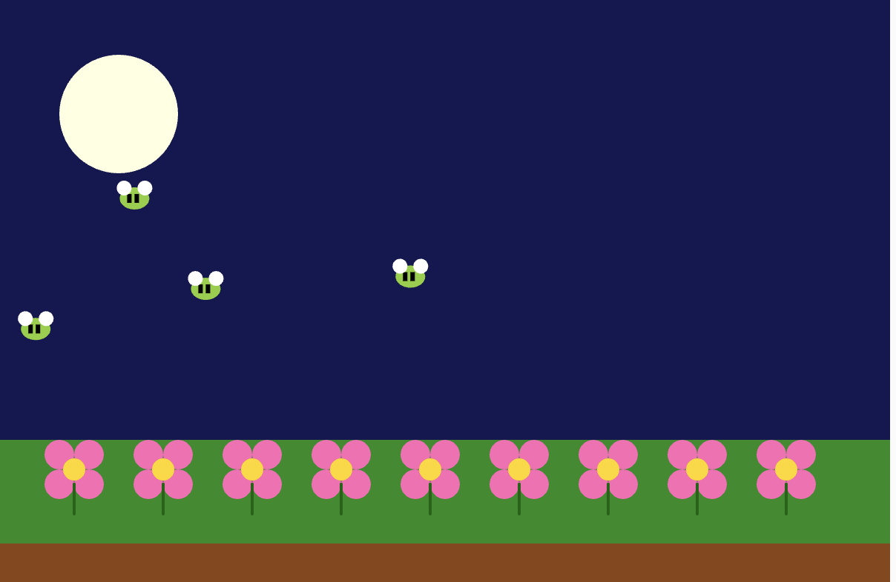

# **🔹 Interactive Garden – Prework Project Overview**

---

## **Interactive Garden**

**Date:** 18 June - July 6, 2025

**Project Type:** Prework Submission – Intro to Programming

**Sketch File:** interactive_garden/sketch.js

[**ps5 Editor File Link**](https://editor.p5js.org/qoryhanisagal/sketches/Y8uJ5qZy1)

---

### **🔹 Project Concept**

The goal was to build an _Interactive Garden_ where users can:

- Click to plant flowers
- Toggle between day ☀️ and night 🌙 by clicking the sun/moon
- Watch bees (or fireflies at night) fly across the screen 🐝
- See the environment change depending on the time of day

The plan is to demonstrate four key concepts:

1. **Variables** – to manage state like the sky color, sun/moon, bee positions, and flicker effect
2. **Conditionals** – to switch visuals based on day/night
3. **Loops** – to render repeated elements like flowers and bees
4. **Functions** – to modularize reusable drawing logic (like drawFlower)

---

### **🔹 What I Built**

- A static garden that switches from day to night with a mouse click.
- The _sun_ becomes a _moon_, and the background color shifts.
- A **custom drawFlower() function** creates reusable flowers using ellipses and a stem line.
- **User-planted flowers** are saved to an array and redrawn every frame.
- **Bees** fly across the screen from left to right and loop back when they reach the edge.
- At night, the bees turn into **lime-green fireflies** that flicker using a random alpha.

---

### **🔹 Bugs + Fixes + Discoveries**

### **🔹Issue 1: Clicking didn’t plant flowers**

Originally, I had all my drawing logic inside setup(), but I learned that anything involving mouse interaction needs to live in draw() or a function triggered after setup — like mousePressed().

**Fix:** Moved the flower-planting logic into mousePressed() and confirmed it was redrawing on each frame.

### **🔹 Issue 2: Sky toggled on every click — even when planting!**

When I added isDay = !isDay to toggle sky colors, it happened **every time I clicked anywhere.** I wanted the sky to only toggle when the **sun or moon** was clicked.

**Fix:** I used dist(mouseX, mouseY, 80, 80) to check if the user clicked within the radius of the sun/moon. Only then do I toggle isDay.

### **🔹 Issue 3: Bee movement logic was inside**

### **drawFlower**

This was bad design because bees were being drawn inside every flower loop. That meant logic duplication and bugs if I changed flower rendering.

**Fix:** I cut the bee logic into a new loop that runs inside draw() after all the flowers are drawn.

---

### **🔹 Enhancements + Creative Decisions**

- **Firefly Flicker:** At night, each firefly’s color flickers by assigning a random alpha to the green fill.
- **Multiple Bees:** Used an array of bee objects, each with their own starting position, to animate a more natural swarm.
- **Encapsulated Flower Logic:** drawFlower(x, y) handles all petal, center, and stem drawing so I can easily reuse it across rows and mouse clicks.

---

### **🔹 What I Learned**

- draw() must include background() or else animations will leave trails.
- JavaScript is **case-sensitive** — I once got tripped up by drawflower() vs drawFlower().
- You must **keep logic modular** — bee animation didn’t belong in flower drawing.
- Alpha values (fill(r, g, b, alpha)) are great for creating glow effects.
- You can build interactive logic just by comparing mouse coordinates!

---

### **🔹Features Used**

- **🔹Variables:** isDay, flowers[], bees[], flicker
- **🔹** **Conditional:** if (isDay) { ... } else { ... }
- **🔹Loop:** for loops to draw flowers and bees
- **🔹Custom Function:** drawFlower(x, y)
- **🔹Bonus:** Used dist() to detect clicks on the sun/moon

---

## 🔹 Week 1: June 18–25

**Focus:** Foundations and early sketches

---

### Visual Planning

Before writing any code, I created a digital sketch in **Procreate** to map out my vision for the Interactive Garden.

This helped me plan:

- **The layout** of the canvas: sun in the top left, sky filling the background, grass and soil layers below.
- **Flower positioning** across the grass.
- **Bee placement** and movement path.
- The overall **color palette** and visual feel I wanted.

  **🔹 Day Mode Sktech**
  

  **🔹 Night Mode Sktech**
  

Creating this sketch made the actual coding phase feel more grounded. I knew exactly what I wanted the scene to look like, which helped me break the project down into layers and plan what to build first.

---

### Setting the Scene (Canvas + Layers)

I started my `setup()` function by creating the canvas (`600 x 400`) and drawing the background layers. I used solid fill colors for each layer:

- Sky (`background(135, 206, 235)`) – light blue during the day
- Grass (`rect(0, 300, width, 100)`) – dark green
- Soil (`rect(0, 370, width, 30)`) – rich brown

Then I added the **sun** in the top left using `ellipse(80, 80, 100, 100)`.

---

### Drawing Flowers with a Custom Function

To draw a flower, I created a reusable function called `drawFlower(x, y)`.
This made it easier to:

- Plant flowers across the canvas using a loop
- Later allow users to plant flowers wherever they click

Each flower includes:

- 4 petals (`ellipse`) positioned around a center point
- A golden center
- A dark green stem drawn with a `line()`

I learned that organizing code into functions makes it easier to reuse and keeps things clean.

---

### Making It Interactive (Mouse Clicks)

I wanted users to be able to add their own flowers. So I:

- Used the `mousePressed()` function
- Checked if the mouse was inside the grass area (`mouseY >= 300 && mouseY <= 370`)
- Saved the click coordinates in an array called `flowers`
- Inside `draw()`, I looped over that array to draw all the flowers

#### Bug I hit:

I originally didn’t use an array, and the new flower wouldn’t stay after a new one was added. It would redraw only the most recent flower. That’s when I realized I needed to **store flower positions in an array** and draw all of them each frame.

---

### Using Loops

This project helped me get more comfortable with `for` loops:

- I used one to draw the **initial row of flowers** across the bottom (starting at `x = 50`, spacing them every 60px)
- Another one in the `draw()` loop to render **user-planted flowers** from the array

These loops let me scale my garden without repeating code!

---

### Reflections from Week 1

[**🔹 Week 1: June 18–25 Notion Notes**
](https://www.notion.so/Week-1-June-18-25-22967763e10b807cb033cf61e68317f0?pvs=21)

- I realized that layering shapes is powerful. Simple shapes like ellipses and rectangles can create complex scenes.
- Using **functions** makes my code neater and more flexible.
- Planning ahead visually (with Procreate) helped me organize my thoughts.
- I hit real bugs — not just syntax errors, but logic problems — and that taught me how to debug slowly.
- I was starting to feel confident about combining `mousePressed`, `draw`, and my own variables to make something feel interactive.

This week was about getting the **foundation** down: creating a static scene and then making it dynamic with interaction.

---

# 🔹 Week 2: June 26–July 3

**Focus:** Animation and Interactivity

[**🔹 Week 2: June 26–July 3 Notion Notes**](https://www.notion.so/Week-2-June-26-July-3-22967763e10b80478578fd15ee02228d?pvs=21)

- Introducing bees with random motion
- Using loops to animate multiple bees
- Firefly flicker effect with alpha blending (flicker = random(100, 255)) Do more research
- Problems and fixes:

  - Bee drawing inside wrong function
  - Forgetting to return stroke settings
  - Clicking toggles both sun and plants—refined logic using dist()
  - Flower planting only allowed in grass zone

---

This week was where my Interactive Garden sketch really started to come alive. I focused on building animation, introducing motion and interactivity, and refining the logic behind user input. There was a lot of trial and error, and I definitely had to debug more than once, but I walked away understanding so much more about what it means to bring a creative concept to life using code.

---

### 🔹 Introducing Bees with Random Motion

One of my big goals this week was to add bees that buzzed around the garden to bring movement to the scene. I didn’t want them to just appear — I wanted them to animate.

I started by creating an empty bees array:

```js
let bees = [];
```

Then in setup(), I used a loop to generate multiple bees at random positions along the x and y axes:

```js
for (let i = 0; i < 4; i++) {
  bees.push({
    x: random(-100, width), // Random start across or off screen
    y: random(100, 250), // Random height above the ground
  });
}
```

At first I hard-coded the bee’s x/y, but realized I’d need a loop to animate multiple bees and update their positions every frame.

---

### 🔹 Using Loops to Animate the Bees

Inside draw(), I used a for loop to iterate through each bee in the bees array, draw their bodies and wings, and move them across the canvas:

```js
bee.x += 0.3;
if (bee.x > width + 20) {
  bee.x = -20;
}
```

This gave them a natural looping motion — like they were flying from one side of the garden to the other. This part made me appreciate how loops make animation easier by applying the same update logic to multiple objects.

**🔹 Day Mode Bees Sketch**


**🔹 Day Mode Bees Ps5 Editor Final**

## 

### 🔹 Firefly Flicker Effect with Alpha Blending

Once I had bees working for the daytime, I started experimenting with nighttime. I wanted the bees to transform into glowing fireflies after sunset. I changed their body color from yellow to a lime green using RGBA and added flickering by randomizing the alpha value each frame:

```js
flicker = random(100, 255);
fill(173, 255, 47, flicker);
```

This little touch made them _pulse_ like real fireflies. It honestly surprised me how much atmosphere that one detail added.

**🔹 Night Mode FireFlies**


**🔹 Night Mode FireFlies Final**



---

### 🔹 Problems I Ran Into — and Fixed

**1. Bees were drawing inside the wrong function**

Originally, I had all my bee drawing logic crammed inside my drawFlower() function by accident. That led to bees only appearing when flowers were being drawn. Once I realized that, I moved all bee logic into draw() and later created a dedicated drawBees() function. That helped clean up the code and separated concerns.

**2. Forgot to return stroke settings after drawing stems**

In drawFlower(), I used stroke() and strokeWeight() to draw the flower’s stem. But if I forgot to call noStroke() again after that, it would leave outlines on later elements. I had to make sure I always reset my settings after applying them.

**3. Clicking anywhere toggled both sun/moon and planted flowers**

Initially, I used a single mousePressed() function to toggle day/night **and** plant flowers. But that created a conflict — clicking the grass to plant flowers would also toggle the sky. I refined the logic using dist() to calculate the distance between the mouse and the sun’s center:

```js
let d = dist(mouseX, mouseY, 80, 80);
if (d < 50) {
  isDay = !isDay;
}
```

Only if the user clicked **on the sun or moon** would the background change — otherwise, flower planting would work as expected.

**4. Flower planting not persisting on screen**

Originally, my planted flowers disappeared every time draw() refreshed. That’s when I realized I needed to **store** them, not just draw them. I created a flowers array and pushed coordinates on each valid click. Then I used a loop in draw() to render them continuously:

```js
for (let i = 0; i < flowers.length; i++) {
  drawFlower(flowers[i].x, flowers[i].y);
}
```

---

### 🔹 What I Learned

- The importance of **scope** and keeping functions focused (like separating drawing logic for bees and flowers).
- How **alpha values** in colors can be used to simulate flickering and glowing.
- How to use **dist()** for clickable interactions that feel natural and intentional.
- How to use arrays to **store and persist objects** like flowers or bees over time.
- And most of all: **how to debug creatively** and stay flexible when things don’t work the first (or fifth) time.

This week gave me confidence in working with conditionals, motion, and user input — and I was finally starting to feel like I had ownership over the experience I was building.

# **🔹 Final Touches: July 4–6**

**Focus:** Polish & logic refinement

[**🔹 July 4–6 Notion Notes**
](https://www.notion.so/Final-Touches-July-4-6-22967763e10b80a8bc33d09670bede6a?pvs=21)

- Final toggle mechanic (sun/moon toggle by clicking sun only)
- Bee color changing logic (isDay ? yellow : lime green)
- Firefly pulsing effect
- Final code organization (extracting bee logic into drawBees())
- Confirming beginner-friendly structure

By this final stretch, I was focused on making sure my garden sketch wasn’t just functional — it needed to feel polished, intentional, and beginner-friendly. This phase was where I layered in finishing touches, refactored code for clarity, and made sure every piece of logic was readable and well-contained.

---

### **🔹 Final Toggle Mechanic – Clicking the Sun/Moon**

Originally, my mousePressed() function was doing **too much**. It toggled the day/night state on _any_ click, even when I just wanted to plant a flower. That clearly wasn’t working.

So I fixed it by making the sun (or moon) itself act as the toggle. I used the dist() function to measure how close the mouse click was to the center of the sun/moon. If the distance was less than the radius, I knew the user clicked on the circle:

```
let d = dist(mouseX, mouseY, 80, 80);
if (d < 50) {
  isDay = !isDay;
}
```

This was a small change that made the interaction feel more natural and purposeful. Now, only intentional clicks on the sun or moon toggle the sky — and flower planting works independently when clicking the ground.

---

### **🔹Bee Color Logic – Fireflies at Night**

To keep the bees visible at night, I wanted to make them feel like **fireflies**. During the day, they look like yellow bees. At night, they shift to a glowing lime green using RGBA color mode.

I handled this by wrapping the fill() call in a conditional:

```
if (isDay) {
  fill(255, 204, 0); // Yellow bee body
} else {
  fill(173, 255, 47, flicker); // Lime green glow with alpha
}
```

The bees now feel like part of the environment, reacting to the time of day.

---

### **Firefly Flicker Effect**

To make the night bees feel like _fireflies_, I added a flicker variable that randomizes the alpha (transparency) level of their fill color. This creates a pulsing glow effect that changes slightly every frame:

```
flicker = random(100, 255);
```

It’s subtle but adds life. This taught me how alpha values in p5.js can be used creatively to simulate light or glow — something I plan to use in future sketches.

---

### **Final Code Organization –**

### **drawBees()**

At this point, the draw() function was getting long and cluttered. I realized all the bee logic could be moved into its own function. So I created drawBees() and moved everything related to bee positioning and animation into that block.

This cleaned up my main loop and made the code easier to read and debug:

```
function draw() {
  ...
  drawBees();
}
```

And the drawBees() function:

```
function drawBees() {
  for (let i = 0; i < bees.length; i++) {
    ...
  }
}
```

This reminded me of how important it is to break things into **small, reusable pieces** — especially as sketches get more complex.

---

**🔹 Day Mode Bees Final Ps5 Editors**


**🔹 Night Mode FireFlies Ps5 Editor**


### **Knowledge Confirmation**

As a final check, I walked back through my code and asked:

> “Would I understand this if I were just learning this a week ago?”

- My variables have meaningful names.
- My logic is broken into readable sections.
- I use comments to explain what’s happening step by step.
- My comments helped me remember what I was doing when I need to take a break.
- Every major feature is built using the core concepts I was required to demonstrate:

  **variables, conditionals, loops, and functions.**

This final phase was less about learning new syntax and more about **polishing**, simplifying, and explaining the logic clearly — all skills I’ll need as I move on to team projects or submitting work in the real world.
